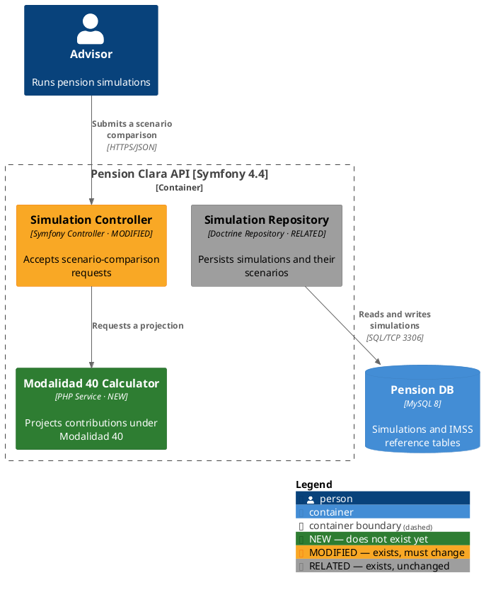

# Diagramming the architectural impact of a change

A requirement document says what the software should do. It does not say which
components already do part of it, which ones have to change, or what is
missing. Your job is to answer that from the repository, classify every
affected component, and emit a C4 Component diagram that a reviewer can read
before a line of code is written.

**The diagram is a finding about the codebase, not a rendering of the PRD.**
A diagram drawn from requirement nouns alone looks authoritative and is
usually wrong — it invents components that don't exist and misses the ones
that actually have to change. Inspect the repository first, every time.

Unlike acsdd's other packaged skills, this one carries its own domain
knowledge (the C4-PlantUML macros and the status colour standard) rather than
reading it from an `acsdd ... --json` command. That is deliberate: those
conventions come from outside this repository and don't drift with acsdd's
detectors, so there is nothing for a Python table to own.

## 1. Preconditions

You need a requirement source and the repository it lands in.

```bash
ls .acsdd/profiles/*.yaml acsdd/profiles/*.yaml 2>/dev/null
```

If there is no requirement document — a PRD, spec, issue, ticket, or
implementation plan — ask for one. Do not reverse-engineer requirements from
the repository and then diagram them; that produces a picture of the present
with no impact in it.

acsdd is **not** required. If a finalized profile is there, read its
`technology_stack` (`framework`, `orm`, `database`, `frontend`) and use those
strings for the technology slot of each component, and `meta.id` for the
container name — they are already agreed facts about this repo. If it is
absent, or only a `*-draft.yaml` exists, detect the stack from the code and
move on without comment.

## 2. Scope the container

A C4 Component diagram shows the inside of **one** container. Name it before
drawing anything:

- **System** — the product the change belongs to.
- **Container** — the deployable unit being changed (an API, a worker, an
  SPA, a CLI). This is the diagram's boundary.

If the change spans containers, do not widen the component diagram to hold
them. Produce a separate C4 **Container** diagram for the cross-container
story, and one component diagram per container that actually changes.

## 3. Inventory the existing components

Walk the repository before mapping anything. Cover, where they exist: entry
points, controllers/handlers, services, domain logic, repositories and
persistence, external integrations, event producers and consumers, queues,
schedulers, and shared libraries.

A component is a logical unit that owns a responsibility — something you'd
name in a design conversation. If renaming it would not change how you
describe the system, it is a class, not a component. Group by responsibility,
never by directory: three classes implementing one responsibility are one
component, and one class doing three unrelated jobs is a finding to raise, not
a component to draw.

Record a `path` for everything you find. You will need it in step 5.

## 4. Map requirements to components

Build the mapping before you build anything else — one row per requirement,
not per component:

| Requirement | Component | Impact |
|-------------|-----------|--------|

Each requirement resolves to one of:

- an existing component that already covers it → **RELATED**
- an existing component that must change → **MODIFIED**
- a responsibility nothing owns → **NEW**
- a component the change makes obsolete → **REMOVED**

A requirement matching nothing is the most interesting row on the table — it
is either a missing component or a missed piece of the repository, and you
have to say which.

Then take the closure: include the direct dependencies of every NEW, MODIFIED,
and REMOVED component, and nothing else. The objective is impact clarity, not
repository visualization — a diagram of everything communicates nothing.

Target **5–15 components**. Past ~15, split by flow or use case rather than
shrinking the analysis: each diagram stays scoped to one container, and a
component shared between two flows is repeated in both, RELATED in whichever
one does not change it.

## 5. Propose, then stop

Present the mapping table from step 4 plus **one** inventory table, and wait:

| Component | Path | Current state | Proposed state | Change | Confidence |
|-----------|------|---------------|----------------|--------|------------|

- RELATED, MODIFIED and REMOVED rows cite a real path. NEW rows cite the
  *proposed* path.
- Anything you could not find a path for is not a component you know about —
  say so in the row rather than filling the cell.
- Mark low-confidence rows as low confidence. Do not round up.

**Do not write any PlantUML before the user responds.** A wrong mapping is
cheap to fix here and expensive to fix once it is a diagram. If they
reclassify a component, use their classification without arguing.

## 6. Emit the diagram

Write two files, creating `docs/architecture/` if it does not exist:

- `docs/architecture/<slug>.puml` — the diagram source.
- `docs/architecture/<slug>.md` — the architecture impact summary (prose),
  the inventory table from step 5, and the requirement-to-component mapping.

Use this shape:



Rules that keep the output readable and diffable:

- **Every macro call stays on one line, however long it gets.** PlantUML's
  preprocessor has no line continuation: a wrapped `AddElementTag(...)` or
  `Component(...)` fails with a bare `ERROR / <line number>` that names
  nothing useful. This is the single easiest way to produce a `.puml` that
  will not render.
- **Status appears twice: as a tag and as a suffix in the technology slot.**
  The colours alone fail in grayscale and for red/green colour blindness, and
  a diagram whose meaning survives only in colour is a diagram that will be
  misread in a printed review.
- `SHOW_LEGEND()` generates the legend from the `$legendText` values. Do not
  hand-write a legend, and do not add `LAYOUT_WITH_LEGEND()` — that is a
  second, superseded legend mechanism, not a companion to this one.
- One `Container_Boundary` at the top level. `Person`, `System_Ext`,
  `ContainerDb`, and `ContainerQueue` go **outside** it. Do not nest a
  container boundary inside a system boundary — that is a level of C4 the
  component diagram is not answering.
- Every relationship into or out of a REMOVED component carries
  `$tags="removed"` and says what replaces it. A red box with solid arrows
  reads as still wired in.
- Alias = lowerCamelCase of the component name. Emit components NEW,
  MODIFIED, REMOVED, then RELATED, alphabetically within each group, and all
  `Rel` lines after all components. A re-run then produces a reviewable diff
  instead of a reshuffled file.
- Relationship labels describe the interaction: "Requests a projection", not
  "uses", "calls", or "connects". Add the protocol as the fourth argument
  wherever it is a real boundary.

## 7. Verify

Most repos have no PlantUML renderer installed, so check the source
mechanically first:

```bash
PUML=docs/architecture/<slug>.puml

grep -c '^@startuml\|^@enduml' "$PUML"                       # expect 2
awk '{o+=gsub(/{/,"");c+=gsub(/}/,"")} END{print o"/"c}' "$PUML"   # must match

# Relationships pointing at an undeclared alias (expect no output)
comm -23 \
  <(grep -oE '^[[:space:]]*Rel[A-Za-z_]*\([[:space:]]*[A-Za-z0-9_]+[[:space:]]*,[[:space:]]*[A-Za-z0-9_]+' "$PUML" \
      | sed -E 's/^[^(]*\(//; s/[[:space:]]//g; s/,/\n/' | sort -u) \
  <(grep -oE '^[[:space:]]*(Person|System|Container|Component)[A-Za-z_]*\([[:space:]]*[A-Za-z0-9_]+' "$PUML" \
      | grep -oE '[A-Za-z0-9_]+$' | sort -u)

# $tags values with no AddElementTag/AddRelTag behind them (expect no output)
comm -23 \
  <(grep -oE '\$tags="[a-z]+"' "$PUML" | grep -oE '[a-z]+' | grep -v '^tags$' | sort -u) \
  <(grep -oE '^Add(Element|Rel)Tag\([[:space:]]*"[a-z]+"' "$PUML" \
      | grep -oE '"[a-z]+"' | tr -d '"' | sort -u)
```

Also confirm no alias is declared twice, and that every component in the step-5
table appears in the diagram and vice versa.

Render it if you can — the checks above catch structure, not syntax:

```bash
plantuml -checkonly "$PUML"                              # if it's on PATH
docker run --rm -i plantuml/plantuml -tsvg -p < "$PUML" > "${PUML%.puml}.svg"
```

Both exit non-zero on a broken diagram. Note `-p` (pipe mode): without it the
image reports `No file found` on stdin. **Do not send the diagram to the
public plantuml.com server** — that publishes the architecture of a private
repository to a third party. Render locally or ask first.

`SHOW_LEGEND()` only lists tags the diagram actually uses, so a missing
REMOVED row in the legend means nothing was classified REMOVED, not that the
tag is broken.

If the repo uses acsdd and the change introduced NEW components, say so and
point at the packaged `capability-plan` skill: new components usually imply
capabilities that no manifest covers yet.

## Constraints

- **Never draw a component you did not find in the repository or propose in
  the mapping table.** Requirement documents are full of nouns that sound like
  services and are not; a plausible invented component sends implementation
  down a path that does not exist. Every non-NEW component has a path.
- **Never show a container-level or system-level element inside the component
  boundary to make a relationship reachable.** If the story needs another
  container, it needs a container diagram.
- **A REMOVED component is a commitment, not a suggestion.** Only classify
  something REMOVED when the requirement actually deletes, replaces,
  deprecates, or disconnects it. "Probably obsolete" is RELATED with a note.
- **Prefer fewer components with real responsibilities over a complete-looking
  map.** Five components a reviewer trusts beat twenty they have to audit.
- Re-run the whole analysis when the requirement changes. Editing a diagram to
  match a new spec without re-reading the repository is how it stops being a
  finding and becomes decoration.
